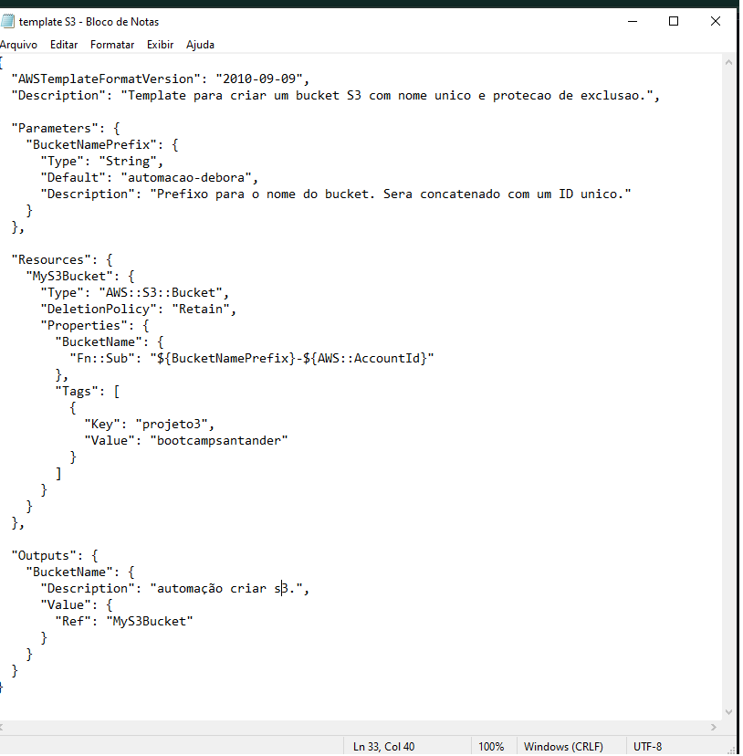
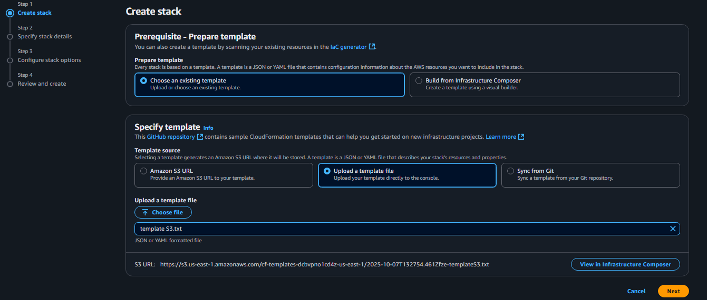
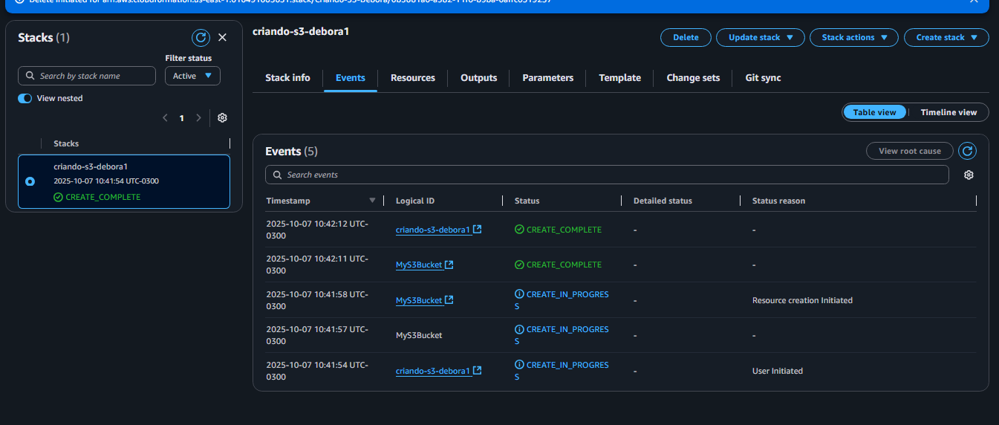
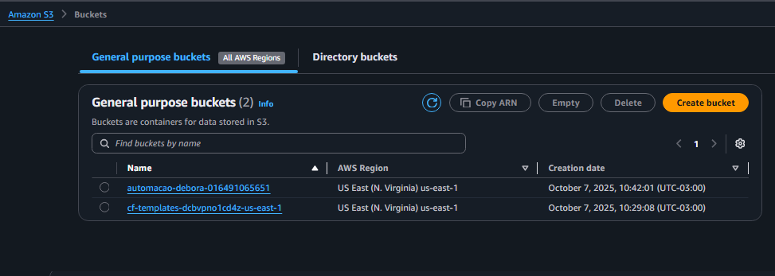
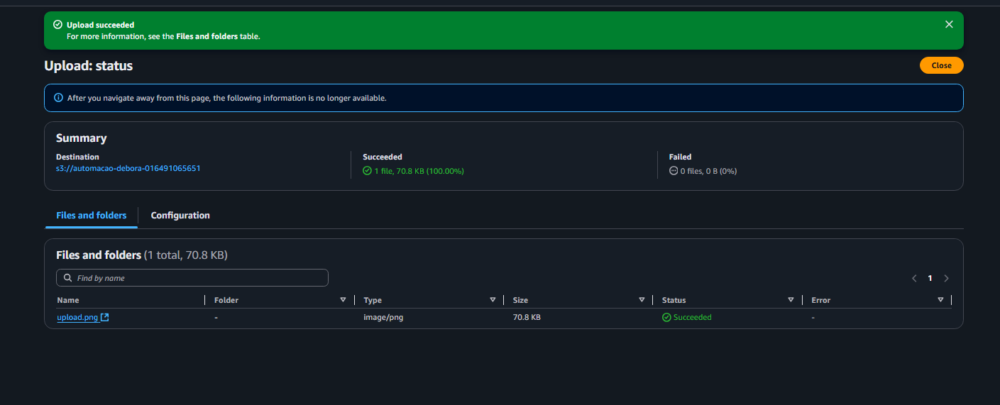

# Automação AWS-CloudFormation

O AWS CloudFormation é um serviço de infraestrutura como código (IaC) da AWS. Ele permite a definição e gerenciamento da infraestrutura na nuvem de forma automatizada e segura, usando arquivos de texto chamados templates em formatos como JSON ou YAML.

Em vez de criar cada recurso (como servidores EC2, bancos de dados RDS ou buckets S3) manualmente no console da AWS, é feita a descrição da infraestrutura inteira em um único template. O CloudFormation então lê esse "plano" e provisiona todos os recursos.

## Principais Vantagens
  * Automação e Repetibilidade: Você pode provisionar a mesma infraestrutura de forma consistente em diferentes ambientes (desenvolvimento, teste, produção), eliminando erros manuais.

  * Gerenciamento Unificado: Ele gerencia um conjunto de recursos relacionados como uma única unidade, chamada de stack. Isso simplifica a criação, atualização e exclusão de ambientes completos.

  * Rollback Automático: Em caso de falha durante a criação de um stack, o CloudFormation reverte todas as mudanças, restaurando o ambiente ao seu estado original.

  * Controle de Versão: Como os templates são arquivos de texto, você pode armazená-los em um repositório como o GitHub para ter um histórico completo das alterações.

# Automação de criação de Bucket S3 na AWS através do CloudFormation.

Este template inclui boas práticas, como o uso de um nome de bucket dinâmico para evitar conflitos e uma política de exclusão para prevenir perdas acidentais de dados como mostra a figura 1.

Figura 1 - Template para criar bucket S3

Inicialmente faz a criação do Stack para realizar o upload do arquivo em formato JSON mostrado na figura 2.

Figura 2 - Upload do Template

Após a execução bem sucedida do template as figura abaixo mostram o Bucket e os eventos criados pelo Stack.

Figura 3 - Execução do Stack

Figura 4 - Bucket criados após a excução do Stack

Após a criação do bucket foi carregado um arquivo do tipo png para teste do S3, como mostrado na figura 5 abaixo.

Figura 5 - Upload de arquivo no Bucket recém-criado.
